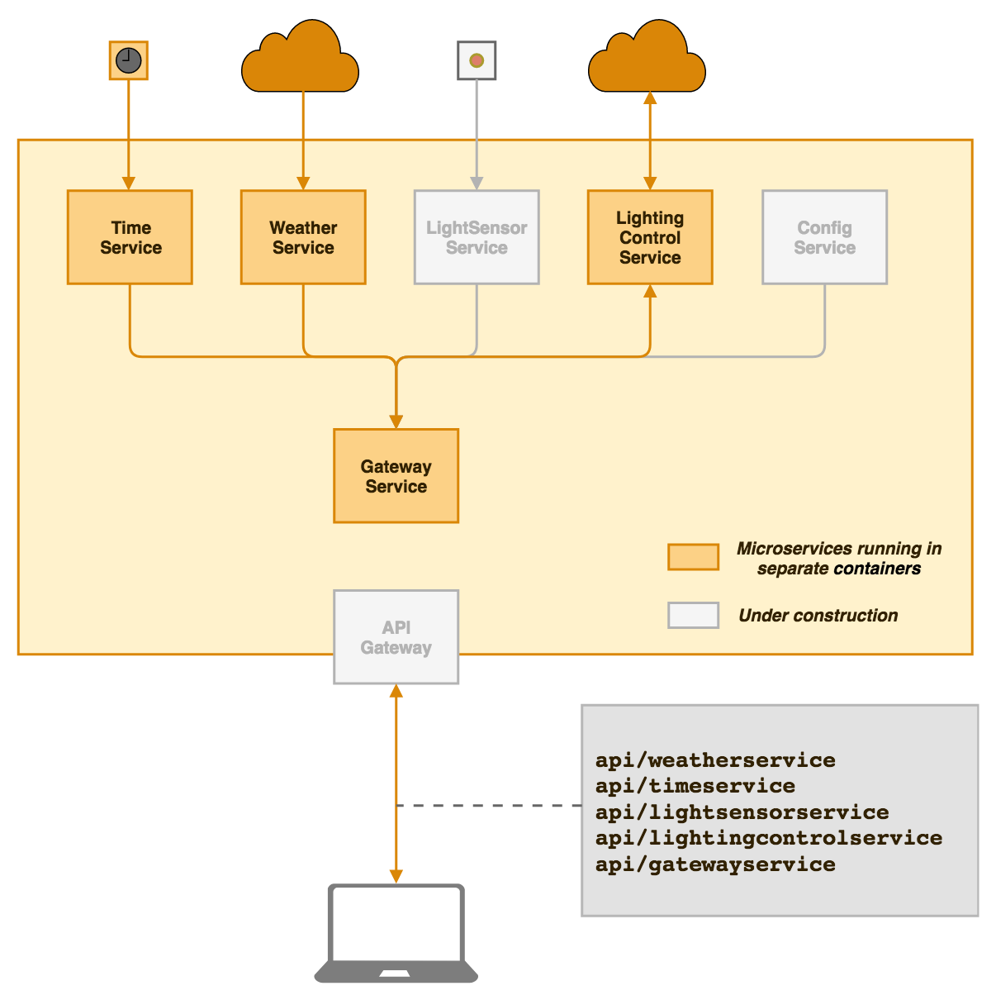

# Introduction

So what is actually happening here?

We are moving to a new office, and we, of course, want to be modern and cool while doing that. So, we decided to dive into the world of the Internet of Things.

In an office, we would, of course, need lightning, so we thought that it might be a good starting point for introducing the IoT. However controlling the on and off switch via the Internet is a bit too simple, so we decided to take it one step further.

And as we all know, people tend to be more sleepy, or feeling less productive at some times of the day, or in some specific situations. For instance, early mornings is the time when you often feel a bit more sleepy. Fortunately, we can help with that by introducing special lighting (and coffee...) to make you feel a bit more awake! In the afternoons, when you've been working hard for many hours already and it's getting dark outside, you might need a bit more warm and bright light. Or just imagine if it is freezing cold outside, and you would love to have some warm, intense lighting while working hard on that deadline that is just a few days away.

Fear not! We have got your back, we have git some light bulbs that can be controlled with bits and bytes. Many of you might have already used these – it is the Philips Hue bulbs. These are the bulbs that can, for instance, be controlled via an app on your phone.

However, as we are a company of geeks, we don't want to sit and control these manually every day. So we need a system to help us during the day.

# The Architecture

## Facade, or Anti-corruption layer
Let's start from the beginning: controlling the light bulbs. Philips has made an SDK, available as jar files.

However, the API is a bit complicated and challenging to work with. It's also subject to change without us being able to control it. So we decided to create a module wrapping the SDK.

This way, we have produced a facade for the SDK that exposes two operations:
* get the number of registered light bulbs
* switch the brightness and colour of a given light bulb

The original SDK is much more intricate and feature-rich, so we have simplified into just these.

This gives us the ability to control which calls are made to the bulbs, and it also acts as _an anti-corruption layer_, preventing the library's code and terms to leak into our system. We're using the term _facade_ for this module.

### Gateway
To control the facade, we have built a gateway, as a separate microservice.

This is the service that actually decides what light we shall have. Its major responsibility is to get input, transform it into what they should mean for our lights, and then tell the facade what to do.

The gateway talks with two different input providers: weather and time services. Those will be described below.

Note that it's the gateway's responsibility to transform the temperature or time into light implications.

### Weather
The default input provider is the weather service. This service gets the weather forecast for the given area and extracts the temperature.

### Time
The other input provider is the time service. This service simply gets the current time.

# The Implementation

### What is MicroProfile
But where are the MicroProfile usage, you might be wondering? Don't worry, we'll come to that.

And what is MicroProfile? JakartaEE for microservices easily said.

While Jakarta EE is a great toolbox for more monolithic architectures, it is a bit overkill for microservices. MicroProfile is a more right-sized toolkit for microservices.

It also bears with it a lot of standardization efforts, to allow for easier replacement of specific tools and thus reduce vendor lock-in

There are several implementations of MicroProfile. We have, a bit arbitrarily, worked only with Wildfly Swarm, but we could as well have chosen among a handful of others.

#### MicroProfile Features in the Facade Service
Things to talk about from the facade
 * [CDI][1]
 * [JAX-RS][2]
 * JSON-P

[1]: https://github.com/mehmandarov/microprofile-iot/blob/5ea12d6c18473a63ca48ed002692b90b8249004b/hueAPI/src/main/java/no/cx/iot/philipshueapi/hueAPI/logic/SetupController.java#L14
[2]: https://github.com/mehmandarov/microprofile-iot/blob/244192f73b744b1326e0e0c376fbc30c97332348/hueAPI/src/main/java/no/cx/iot/philipshueapi/hueAPI/FacadeEndpoint.java#L61

#### MicroProfile Features in the Gateway Service

 * [Fault tolerance][3]
 * [Health check][4], e.g. http://localhost:8080/health
 * [Config][5]
 * [The conversion][6] between the data from the services into a light bulb control direction
 * [REST client hack][7] – this indicates that MicroProfile, as well as its implementations, still is a technology under constant development and that everything is not yet mature. However, certain features we have made use of were not available when we started the preparations for this presentation. For instance, OpenAPI wes included in the Wildfly Swarm implementation just a couple of weeks ago.

[3]: https://github.com/mehmandarov/microprofile-iot/blob/244192f73b744b1326e0e0c376fbc30c97332348/gateway/src/main/java/no/cx/iot/philipshueapi/hueController/rest/hueAPI/HttpConnector.java#L48
[4]: https://github.com/mehmandarov/microprofile-iot/tree/master/gateway/src/main/java/no/cx/iot/philipshueapi/hueController/rest/healthcheck

[5]: https://github.com/mehmandarov/microprofile-iot/blob/244192f73b744b1326e0e0c376fbc30c97332348/gateway/src/main/java/no/cx/iot/philipshueapi/hueController/rest/weatherConnector/WeatherToLightStateConverter.java#L19

[6]: https://github.com/mehmandarov/microprofile-iot/blob/244192f73b744b1326e0e0c376fbc30c97332348/gateway/src/main/java/no/cx/iot/philipshueapi/hueController/rest/weatherConnector/WeatherToLightStateConverter.java#L31

[7]: https://github.com/mehmandarov/microprofile-iot/blob/244192f73b744b1326e0e0c376fbc30c97332348/gateway/src/main/java/no/cx/iot/philipshueapi/hueController/rest/hueAPI/HttpConnector.java#L52 

#### MicroProfile Features in the Time and Weather Services

 * [OpenAPI][8]
 * And more of the stuff we’ve already seen: CDI, JAX-RS, JSON-P, config, etc.
 
[8]: https://github.com/mehmandarov/microprofile-iot/blob/244192f73b744b1326e0e0c376fbc30c97332348/timeservice/src/main/java/no/iot/timeservice/rest/TimeServiceEndpoint.java#L30

# Other Noteworthy Stuff

### Maven and the Local Repositories
Maven is the building system we are most familiar with, so we use it for building the projects. 

The Hue SDK is not available in Maven central, at least not yet, so we figured we had to do something smart for the code to compile with Maven. We have created a local maven repository and added the SDK to it. 

Yes, it was somewhat hassle getting started with, but there are some good guides online. Also, when it's first properly setup, it just works and keeps working.

# Future Work

As you have seen, we have used a lot of the features included in MicroProfile in this project. However, there are some we haven't exploited yet:
 * Rest client, as mentioned
 * JWT authentication
 * OpenTracing

We also have some other further work coming up:
 * Push it to GCP
 * Create the remaining services
 * And lots of other cool stuff... Stay tuned!
